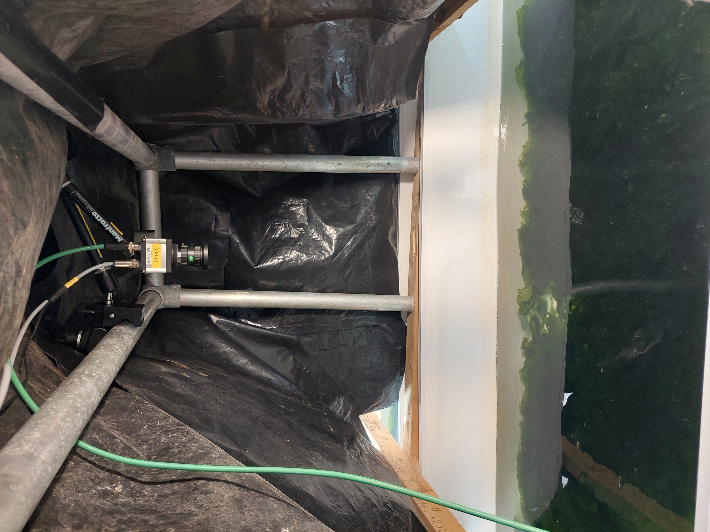
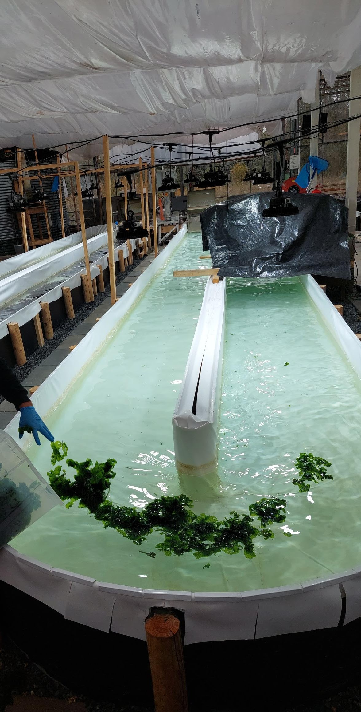
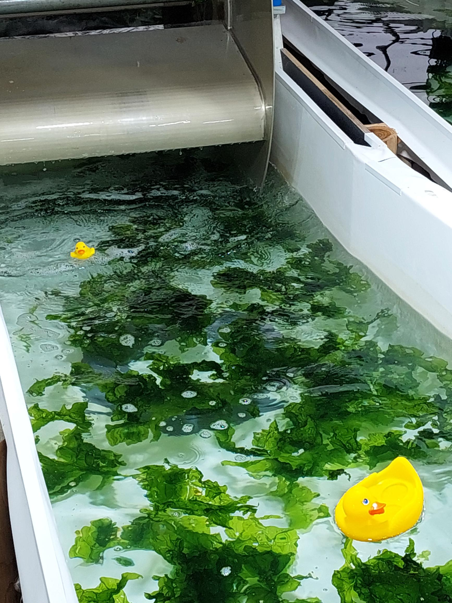

# SeaweedSight: Estimating biomass density in land-based cultivation of Ulva spp. using a low cost RGB imaging system
[[`paper`](google.com)]
[[`dataset`](https://doi.org/10.5281/zenodo.18849922)]


> The code associated with our [paper](https://google.com) where we demonstrate a method for reliable estimation of *Ulva spp.* biomass in land-based raceways using a low-cost RGB camera. By combining segmentation and regression models, we achieve accurate biomass density predictions (R^2 = 0.98, RMSE = 0.23 g/L), offering a cost-effective solution to reduce labor costs and enable routine, automated monitoring. 


While occasional model predictions may occur at the frame level, these errors are effectively smoothed and mitigated by aggregating data at the per-revolution level (i.e., footage recorded over approximately three minutes), resulting in robust biomass estimates.

## Monitoring setup
An IDS UI-5290-FA-C-HQ camera with a 7 mm lens was mounted approximately 80 centimeters above the raceway (see Figure), with a field of view of 75 cm so that the full width of the raceway was in view of the camera. For camera settings, see the dataset at [Zenodo](https://doi.org/10.5281/zenodo.18849922). For details on the monitoring setup, see the manuscript.


Camera setup | Adding *Ulva spp.* | Flotation device (i.e., rubber duck)
:-------------------------:|:-------------------------: |:-------------------------:
  |  |   


## Setup

```
# install seaweedsight and its dependencies
pip install git+ssh://git@github.com/geoJoost/SeaweedSight.git

# Setup the environment
conda create -n seaweedsight
conda activate seaweedsight

conda install pip

# Modify this installation link to the correct CUDA/CPU version
# See: https://pytorch.org/get-started/locally/
pip3 install torch torchvision

pip install --upgrade huggingface_hub transformers

conda install -c conda-forge numpy pandas scikit-learn scikit-image opencv matplotlib seaborn statsmodels pillow

```
## Getting started
To reproduce the results in the manuscript:
1. Download the dataset from [Zenodo](https://doi.org/10.5281/zenodo.18849922) and place it in `/data/` folder at the root of this project.
2. Run the script: `main.py` with default parameters

To test on your own dataset:
1. Record footage of your cultivation system in similar circumstances to the GIF above.
2. Store the .mp4 or .avi in `/data/inference/`.
3. Run the script `inference.py` **NOT IMPLEMENTED YET**

---
If you use this code or dataset, please cite our [paper](google.com). For questions, feedback, or collaborations, feel free to [contact us](mailto:joost.vandalen@wur.nl).


